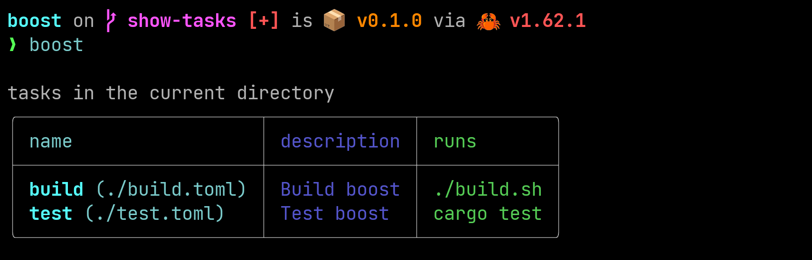
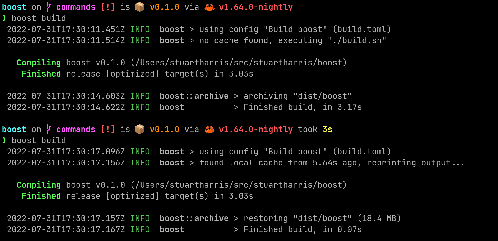
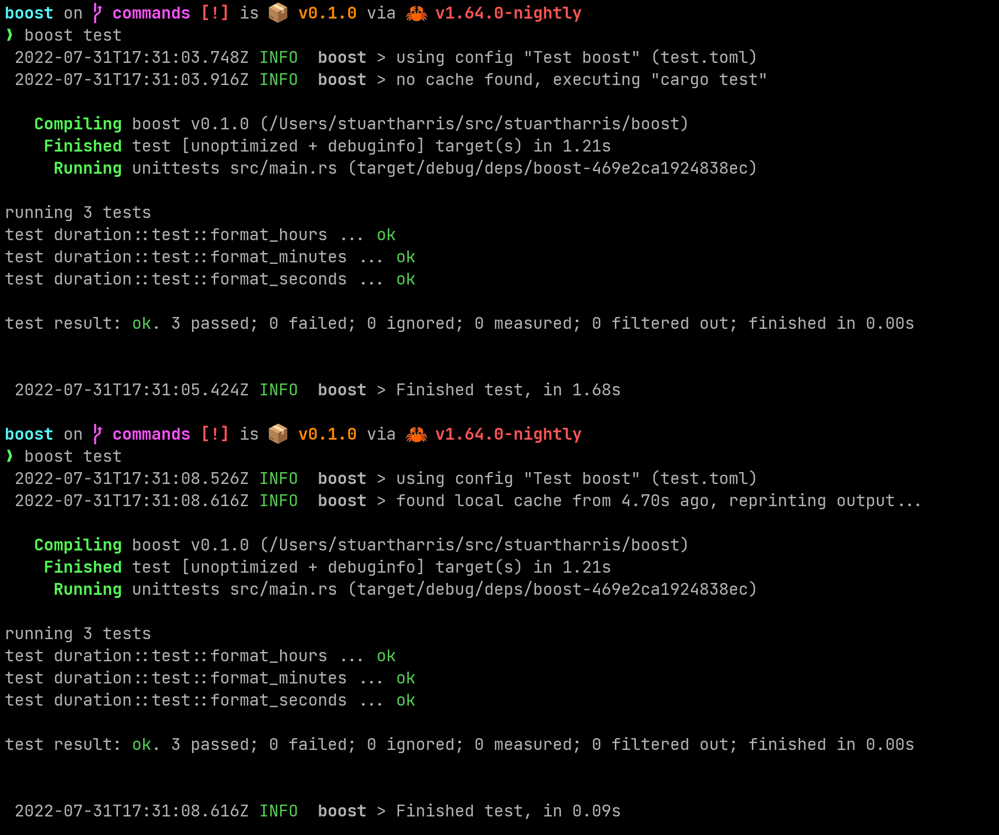

# Boost

## Why Boost?

Our planet is burning, and everywhere I look I see CI pipelines repeating work that has already been done.

Tools such as [TurboRepo](https://turborepo.org/), [Nx](https://nx.dev/) and [Bazel](https://bazel.build/) are amazing for working out what needs to be done and only doing each thing once, reusing outputs from previous runs where they can.

We should use these tools wherever possible because everyone wins — we get faster feedback and the planet thanks us because the energy required to recompute the outputs is not used.

These tools are big though, and in some cases require an all-in commitment (Bazel, as brilliant as it is, takes over your native toolchain). Also they can be quite ecosystem specific (TurboRepo does work in a Rust monorepo, but you have to include `package.json` files everywhere, which doesn't spark joy). All of them seem to be designed to work in a monorepo (I love a monorepo by the way).

It struck me that what we need is a "small, sharp tool" that "does one thing, and does it well", as per the UNIX Philosophy. Hence Boost. Boost only runs a task if any of the declared inputs have changed since a previous run, otherwise it restores the outputs from that previous run.

That's all it does. So hopefully you can use it easily, in more places, and without (yet) going all-in on a bigger tool.

## Great for CI pipelines

Wrapping tasks in your CI/CD pipelines with `boost` will always remain simple, easy, and non-intrusive. It will only work, though, for "pure" tasks, i.e. deterministic tasks that will always produce the same outputs given the same inputs. In our opinion all pipelines should be like this anyway.

If there is anything non-deterministic in your pipeline (e.g. a potentially variable environment), you can capture it with the `invariants` in the task's config. This will ensure that the right cache key is used. The `env_vars` and `input.files` config sections are essentially specializations of `invariants` that should be useful (but ultimately could be expressed as invariants for the same result: e.g. `invariants = ["echo $TEST"]` has the same effect as `env_vars = ["TEST"]`).

## Installing Boost

For now...

```bash
> cargo install --git https://github.com/StuartHarris/boost.git
```


Soon, we'll publish to crates.io and support homebrew etc.

## Configuring Boost

Each task needs a simple TOML config file. For example, create a file called `build.toml` and run it with `boost build`.

You can list the tasks that have configuration files in the current directory by running `boost` (with no arguments).



You can run multiple tasks, e.g. `boost build test`.

Here is a file to build boost itself ([`build.toml`](./build.toml)).

> "We want `boost` to build `boost` using the shell script `build.sh` _only_ if we haven't already cached the specified outputs, which were generated from the specified inputs, in the `dist` folder. If we have a matching cache we'll restore the outputs to the same place".

```toml
description = "Build boost"
run = "./build.sh"

[input]
invariants = ["rustc -vV"]
env_vars = ["TEST"]

# these are the defaults, so you could miss this out if you want to
[[input.files]]
root = "."
filters = ["*"]

[[output.files]]
root = "dist"
filters = ["dist/boost"]
```

When calculating the hash for the cache-key, we visit every file from the root that matches any of the globs, hashing their contents.

We also run the specified invariants (commands) and hash their outputs (currently `stdout`). So for instance if you want to make sure your cache is no older than a day, you could specify an invariant of `date +%y-%m-%d`.

We also hash the specified environment variables and the tasks' config files.

A change in _any_ of these inputs will result in a new run.

In this screenshot, we can see that the compilation happened the first time, but not the second time.



For another example, see [`test.toml`](./test.toml).

```toml
description = "Test boost"
run = "cargo test"

[input]
invariants = ["rustc --vV"]

[[input.files]]
root = "."
filters = ["./src/**", "./Cargo.*"]
```

This is for running unit tests, so we don't need an `[output]` section.



## Coming soon

- [ ] imports, e.g. `dependsOn` (include the hashes from dependent boosts in the current boost’s hash)
- [ ] green credentials
  - [ ] aggregate time saved and other stats (e.g at cache root)
  - [ ] ask to share these (anonymously and publicly)
  - [ ] link to e.g. ["Principles of Green Software Engineering"](https://principles.green/)
  - [ ] add a section to the readme with examples of potential carbon cost savings
- [ ] remote cache
  - [ ] S3 compatible (can use e.g. [Garage](https://garagehq.deuxfleurs.fr/) for on-prem)
  - [ ] output e.g. "`found cache in eu-west-1 from 3 days ago`"
  - [ ] atomic writes, optimistic concurrency
- [ ] add ignore filter to `input.files`
- [ ] cache cleanup, e.g. rolling removal of old cache items
- [ ] configurable options
