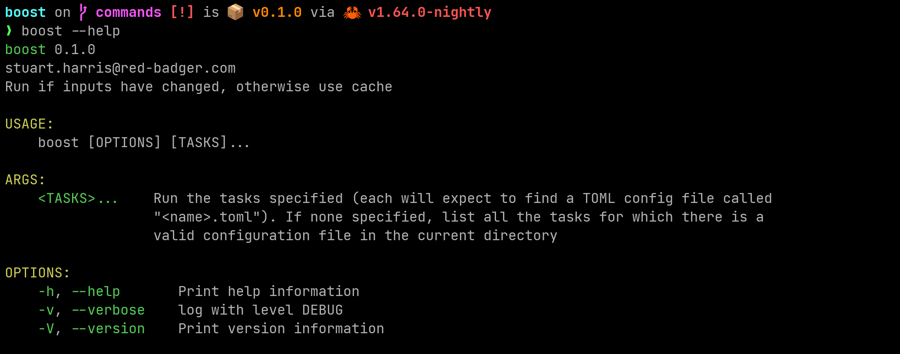

# Boost

## Why Boost?

Our planet is burning, and everywhere I look I see CI pipelines repeating work that has already been done.

Tools such as [TurboRepo](https://turborepo.org/), [Nx](https://nx.dev/) and [Bazel](https://bazel.build/) are amazing for working out what needs to be done and only doing each thing once, reusing outputs from previous runs where they can.

We should use these tools wherever possible because everyone wins — we get faster feedback and the planet thanks us because the energy required to recompute the outputs is not used.

These tools are big though, and in some cases require an all-in commitment (Bazel, as brilliant as it is, takes over your native toolchain). Also they can be quite ecosystem specific (TurboRepo does work in a Rust monorepo, but you have to include `package.json` files everywhere, which doesn't spark joy). All of them seem to be designed to work in a monorepo (I love a monorepo by the way).

It struck me that what we need is a "small, sharp tool" that "does one thing, and does it well", as per the UNIX Philosophy. Hence Boost. Boost only runs a command if any of the declared inputs have changed since a previous run, otherwise it restores the outputs from that previous run.

That's all it does. So hopefully you can use it easily, in more places, and without (yet) going all-in on a bigger tool.

## Installing Boost

For now...

```bash
> cargo install --git https://github.com/StuartHarris/boost.git
```



Soon, we'll publish to crates.io and support homebrew etc.

## Configuring Boost

Currently the only option is to specify a config file to use. See the road map below to see what improvements are coming. In the meantime, create a `toml` file and run it with `boost -f`.

Here is a file to build boost itself ([`build.toml`](./build.toml)).

> "We want `boost` to build `boost` using the shell script `build.sh` _only_ if we haven't already cached the specified outputs, which were generated from the specified inputs, in the `dist` folder. If we have a matching cache we'll restore the outputs to the same place".

```toml
description = "Build boost"
run = "./build.sh"

[[inputs]]
root = "."
filters = ["*"]
commands = ["rustc -vV"]
env_vars = ["TEST"]

[[outputs]]
root = "dist"
filters = ["dist/boost"]
```

When calculating the hash for the cache-key, we visit every file from the root that matches any of the globs, hashing their contents. We also run the commands specified and hash their outputs (currently `stdout`). We also hash the specified environment variables.

Additionally, the config itself, and the command line arguments being used, all contribute to the hash (and therefore determining if there is a cache hit).

This means that a change in _any_ of those inputs will result in a new run.


For another example, see [`test.toml`](./test.toml).

```toml
description = "Test boost"
run = "cargo test"

[[inputs]]
root = "."
filters = ["*"]
commands = ["rustc --vV"]
```

This is for running unit tests, so we don't need an `[[outputs]]` section.


## Road map

- [ ] S3 compatible (can use Garage for on-prem)
- [ ] Picks up compatible toml files from the current directory automatically so that `boost ls` would list available commands. And a build.toml enables “boost build” (as shorthand or “boost run build” in longhand)
- [ ] Refactor more like onion
- [ ] More tests
- [ ] Says
  - [ ] “found cache in eu-west-1 from 3 days ago”
  - [x] “no cache found”.
  - [x] “found local cache from 10mins ago”
- [ ] Stores and retrieves remotely
- [ ] Set executable bit on retrieved files
- [ ] Imports (include hash from dependent boosts in the current boost’s hash)
- [ ] Metadata in toml config e.g.
  - [ ] name
  - [ ] description
- [x] Refactor input and output config
  - [x] input.files (each has root and filters)
  - [x] input.env_vars
  - [x] input.invariants (was commands)
  - [x] output.files (each has root and filters)
- [x] Stores and retrieves locally
- [x] Hash must include
  - [x] config toml
  - [x] command line arguments
- [x] Inputs from running user defined command like `rustc -vV`
  - [x] Call these invariants
- [x] Handle failures
